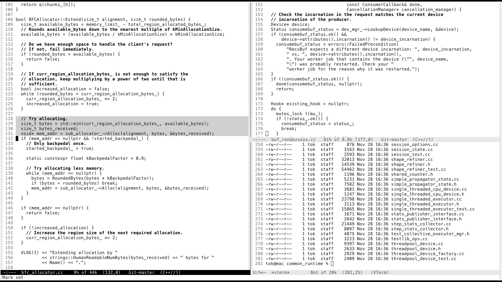
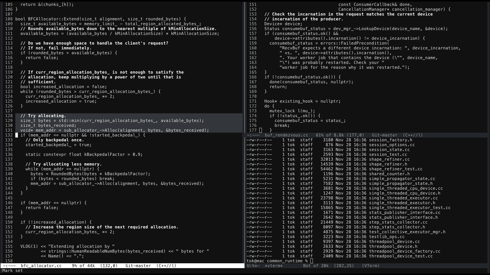

## About

Personal preferences for various coloring in Emacs.

## Screenshots 

### Minimal 





## Installation

### MELPA

``` elisp
(use-package tok-theme
  :config
  (load-theme 'tok-light t))
```

### Local

You can also install this theme by copying it to your `.emacs.d`. I use `themes`
directory for holding this so I can load it with: 

``` elisp
(add-to-list 'custom-theme-load-path "~/.emacs.d/themes")
(load-theme 'tok-light t)
```

Or with `use-package`:

``` elisp
(use-package tok-theme
  :load-path "themes"
  :config
  (load-theme 'tok-light t))
```

## Contributing

I like to keep my own `.emacs.d` relatively clean so there might be some "ugly"
coloring in some of the modes, since I have most likely just missed that because
I don't use it. If you happen to find some of these, feel free to drop a PR to clean
it.
